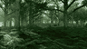

# CYBR FOREST

Native C++20 rendering and procedural vegetation from the restored CYBR VEG forest. The repository name is historical: the rendered footage uses the native renderer, not a claimed Three.js backend.



The animation above is a **96 x 54, four-frame contact thumbnail extracted from the actual restored movie**, not the full-resolution movie and not an image-generated reference.

## Baseline

The original forest contains 25 mesh buffers and 9,810 placed mesh instances. The accepted restored movie contains two moving-camera shots, 96 frames at 1920 x 1080 / 24 fps, four seconds total. Trees are static in that recovery. Diffuse illumination is cached and the volume treatment is approximate; these movies are not certified fully converged path tracing.

The original GPL-2.0 license is retained. The working geometry must remain separate from subsequent higher-detail changes. Generated reference pictures, the rejected Python 2.5D replacement, failure-only reports and nonexistent artifacts are not production renders.

## Publication status

The native renderer, numerical tests and restoration tools are committed. The actual small GIF above has been uploaded and its Git blob hash verified. **The full-resolution movie, the full GIF collection and binary scene assets have not yet been transferred to this repository.** A prepared publication bundle contains 26 video entries, 27 GIF previews and eight still images, plus original scene/material data and provenance. Preparation is not upload completion.

`reports/publication-status.json` describes this boundary. The separate media import tool only accepts a checksum-verified bundle; it never executes downloaded code. Its future success report is not created until every listed file matches its manifest.

## Build and test

```sh
cmake -S . -B build -DCMAKE_BUILD_TYPE=Release
cmake --build build --parallel 4
ctest --test-dir build --output-on-failure
```

To reproduce the restored scene, the original `CYBR_FOREST.glb` must be present at `assets/input/CYBR_FOREST.glb`. Use the restoration driver rather than assuming an absent scene exists:

```sh
python -m pip install -r requirements.txt
python tools/render_restored.py --frames 48 --width 1920 --height 1080 --samples 4
```

## Higher-detail upgrade

The baseline is preserved first. Subsequent work must repair deformation normals and tangent frames, fingerprint all lighting/material/cache dependencies, improve texture minification, rebuild foreground trees, divided fern fronds and hollow fallen logs, and test uncached lighting and moving-camera renders. Passing compilation or decoding is not proof of AAA visual quality or radiometric convergence.
